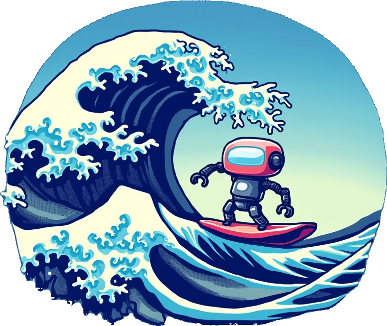

  

        🤗 <a href="https://huggingface.co/collections/agentsea/waveui-6684c5ab7b72cda3a523674c"> HF Collection</a>&nbsp
 

---

# TideUI

Data and tools to improve UI-specific clicking.

There are models today that perform well on the task of clicking on UI elements. Two of the main approaches that have been taken by language models are by detecting the elements with bounding boxes and with points. Both options have been proven to be paths towards high performance on generic UI clicking.

However, for many use-cases, it's not necessary for a model to be performant in **any** UI, but, rather, in a specific UI. For examples, someone looking for flights might be satisfied with a model that performs well on the Google Flights UI.

This project explores a pipeline to improve click models on specific UIs.

## Data

UI-specific click-data can be captured in a process similar to the one outlined in [data/](./data/). For more info, see the instructions there.

## Training

Among others, some of the best open-source models for clicking are:

1. [Molmo](https://huggingface.co/allenai/Molmo-7B-D-0924) 
2. [PaliGemma](https://huggingface.co/agentsea/paligemma-3b-ft-waveui-896)
3. [Moondream](https://github.com/vikhyat/moondream) (in the next release)
4. [ShowUI](https://github.com/showlab/ShowUI)

We will first focus on Molmo, which already has a fairly high performance on clicking. For more info on its performance vs Claude Sonnet 3.5 see [evals/general_clicking/](./evals/general_clicking/)

## Evaluation

TBD

## TODO

- [ ] Update annotator to use clicks again.
- [ ] Add automatic annotation with Sonnet 3.5
- [ ] Run ft script