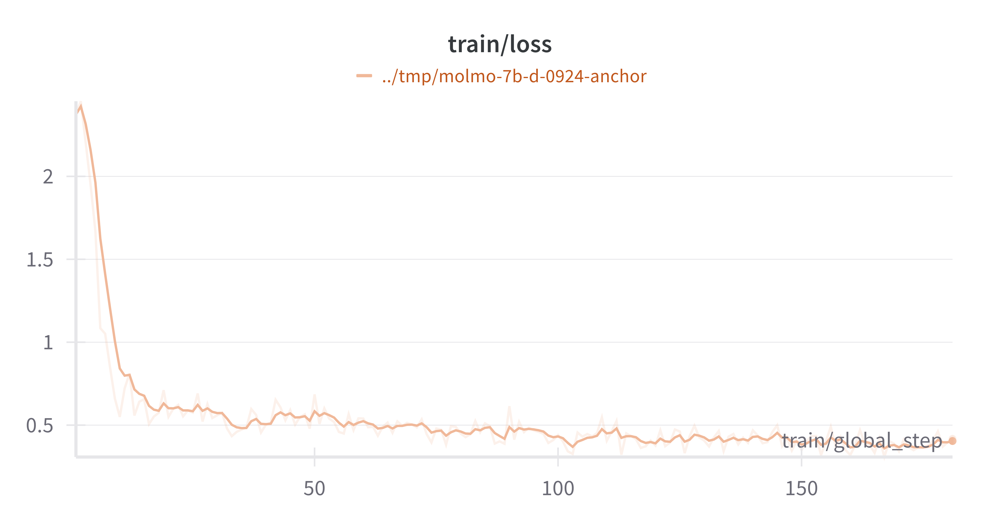
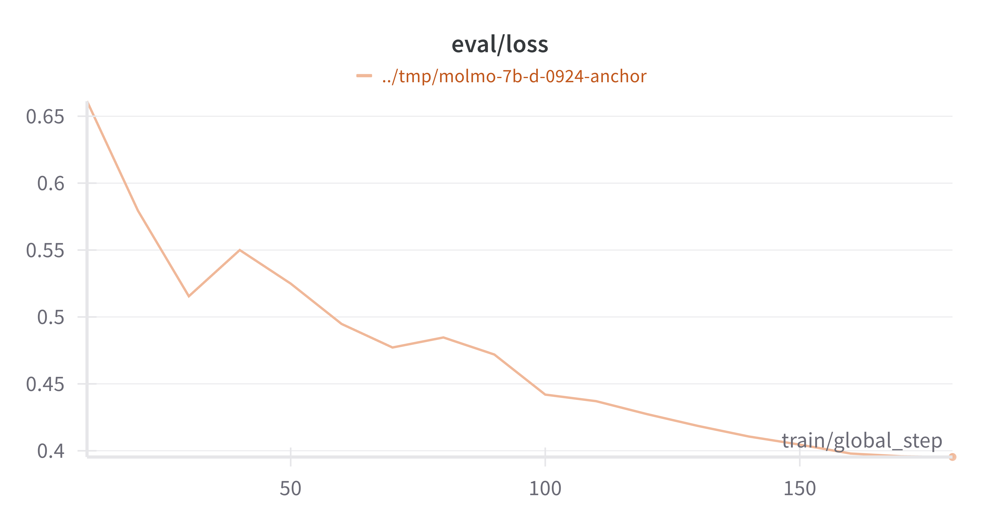

# TideUI

TideUI is a project that aims to develop a pipeline to improve UI-specific models.

There are many models today that perform fairly well on the task of clicking on UI elements. Two of the main approaches that have been taken to improve language models on this tasks are:

- detecting the elements with bounding boxes
- generating explicit points/coordinates

Both options have been proven to be paths towards high performance on generic UI clicking. Some models using the latter are: 

1. [Molmo](https://huggingface.co/allenai/Molmo-7B-D-0924) 
2. [Moondream](https://github.com/vikhyat/moondream)

However, for many use-cases, these models do not perform well on certain UIs. Among other reasons, it could be that UIs are closed and models have not generalized to them, or it could be that they are out of the training data distribution. In whichever case, it is important to be able to quickly teach these models how to interact with specific UIs in a more reliable way.

The TideUI project shows that it is possible to achieve higher performance on specific UIs when fine-tuning the models. We will focus on the fine-tuning both the Molmo and Moondream models for now, given that they are open, keeping the performance of the top closed-source models, like Claude 3.6, as a reference.

## Data

UI-specific click data can be captured in a process that consists of two parts:

1. A collection of screenshots of the UI
2. An annotation of the elements in these screenshots

For this project we built a tool that serves as a PoC for the data gathering. Specifically, it speeds up the process and lowers the cost of annotation by:

- Automating the screenshot-taking process while a user interacts with the UI.
- Automating the annotation by calling an existing model that recieves the image and annotates the element that is clicked-on.

An example of the resulting dataset can be found [here](https://huggingface.co/datasets/agentsea/anchor).

## Training

### Molmo

Until recently, the Molmo training scripts had not been released. However, we built custom training scripts to fine-tune the model using our data. Some of the technical challenges that we had to face to do this were the following:

1. Writing a batch-inference script to make the training more efficient.
2. Writing the data collator to be able to use our collected data.
3. Setting-up a distributed training run using FSDP.

After overcoming these implementation challenges we executed a training run that resulted in noticeable improvement.

The training loss shows signs of learning, while the following evaluation loss shows that we never reached a point of overfitting:

### Moondream

We're currently exploring the possibility of replicating similar results using Moondream, a 2B-parameter model, which would make the training cheaper and more fitting for a click-only model.

The current implementation challenge that we're facing is that Moondream has a different architecture and there is no publicly-available training script for the pointing task. The pointing capability uses a region model, that is not used for general text-generation and we have not found a way to effectively train this. We will update this section soon.

## Evaluation

For a click-model, evaluation could be thought in three different ways:

1. a general UI clicking evaluation that uses the general-UI data from our WaveUI dataset
2. a UI-specific clicking evaluation that uses the test-set from the data gathered.
3. an agent-task evaluation that measures the agent-performance difference between using a non-finetuned model and using a finetuned model as a click model.

For 1 and 2, our evaluation metric is a normalized average distance from the test-set ground-truth. The normalization helps to account for variations in image size. We obtain the following results:

| General UI Clicking |  |
|----------------------|--------------------------|
| Model | Average Normalized Distance |
| Claude 3.6 | 0.06 |
| Molmo | 0.09 |
| Moondream | **0.04** |

*Note: although Moondream performs best in this case, we think it's because our dataset was used during its training. We're expecting to confirm this soon.*

| Specific UI Clicking |  |
|----------------------|--------------------------|
| Model | Average Normalized Distance |
| Base Molmo | 0.07 |
| Finetuned Molmo | **0.03** |
| Base Moondream | 0.15 |
| Finetuned Moondream | TBD |
| Claude 3.6 | TBD |

Right now we're aiming to complete this evaluation with the 3rd evaluation method, which will shed some more light on the benefit of doing this at the agent-level.

## Conclusion

Our preliminary experiments are clearly indicative of potential benefit of fine-tuning on specific-UI click data. The finetune in Molmo shows an increase of 4% of the image-diagonal, which accounts for a relative increase of more than 50% between the base model and the fine-tuned model. Furthermore, we're working on confirming this preliminary result both by using Moondream and by using a more comprehensive evaluation suite at the agent-level.